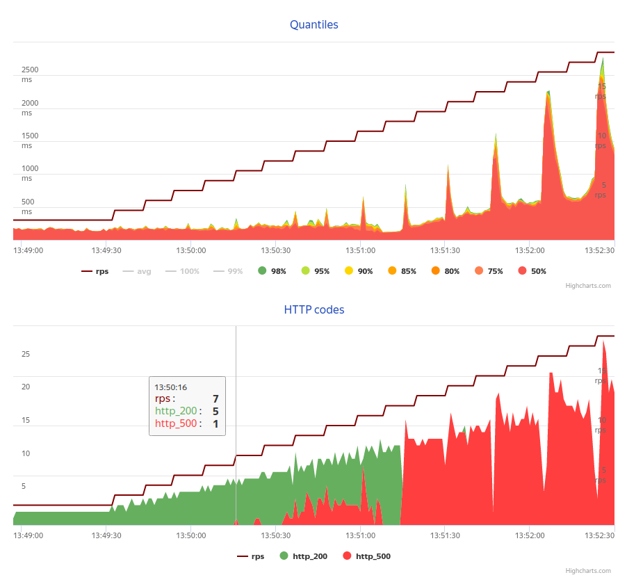
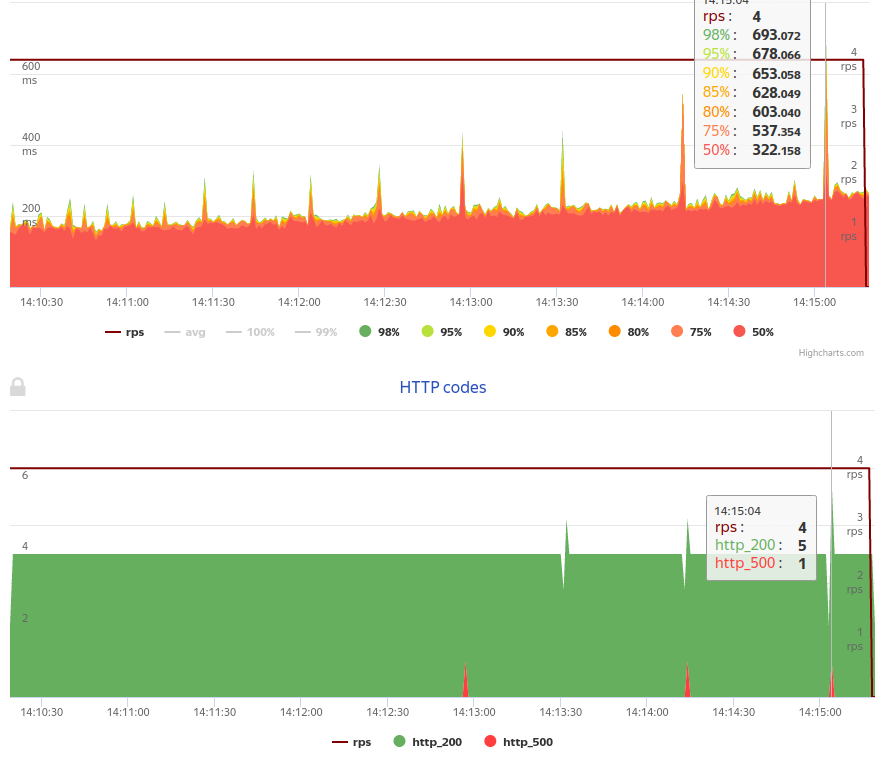
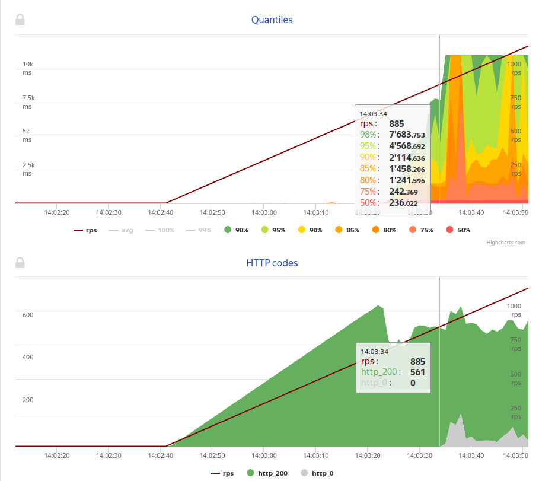
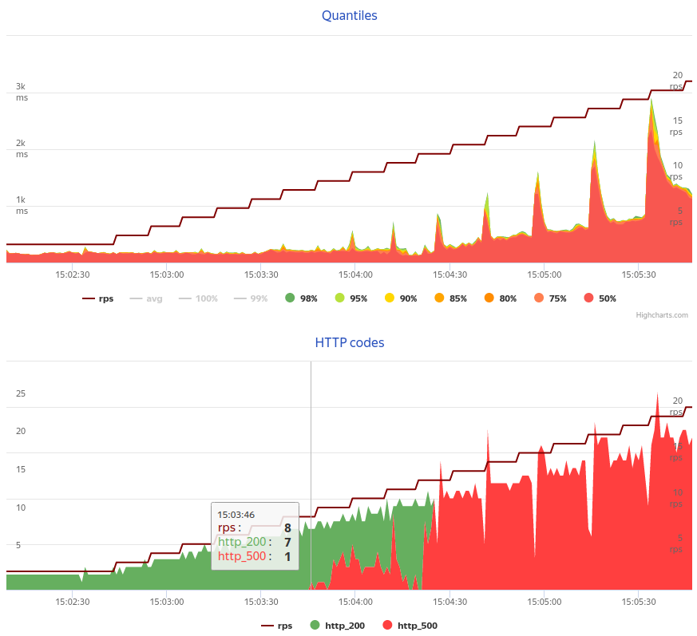
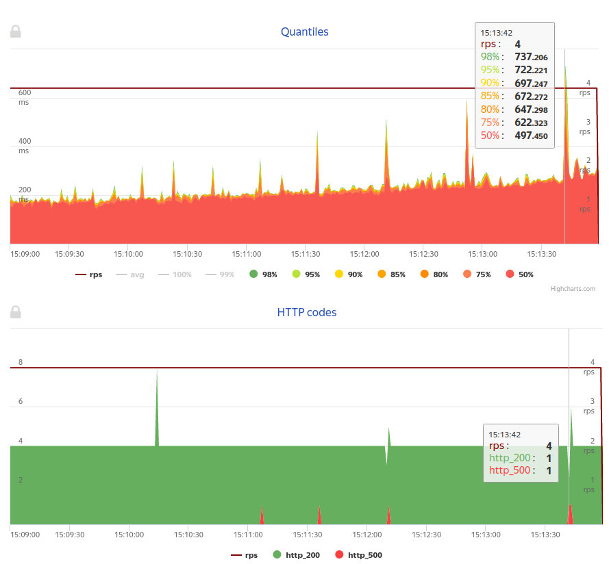

# URL Shortener

## Project description
Web-based service to transform usual URLs to short format

## Build and run

* Build application with:
    ```bash
    docker-compose build
    ```
 
* Start application with:
    ```bash
    docker-compose up
    ```

* Rebuild and specify how many container instances to start:
    ```bash
    docker-compose --build --scale cassandra=2
    ```

    App should start on `http://localhost:5000/`

## Sample requests

* POST

    ```bash
    curl \
    -X POST \
    -H 'Content-Type: application/json' \
    --data-raw '{"original_url":"https://yandex.by"}' \
    http://localhost:5000/createURL
    ``` 

    sample output:
    ```bash
    {
        "short_link": "http://localhost:5000//getURL/AQM=", 
        "original_url": "https://yandex.by", 
        "expire_date": "2021-12-26"
    }
    ```

* GET:

    ```bash
    curl -X GET http://localhost:5000/getURL/AQE=
    ```

    sample output:
    ```
    https://yandex.by
    ```

## Architecture:
* Flask as web framework
* Cassandra as a database
* Docker for containerization
* _nginx as balancer (not working)_
* Yandex.Tank as framework for Load testing

---

## Load testing

### GET reqest: `/getURL`

Tests setup:
* Maximum load: const(2rps, 30s), line(2rps, 30rps, 5m)
* Stability test: const(4rps, 5m)

Results:

Maximum load   |  Stability
:-------------------------:|:-------------------------:
        |  

* After rps (requests per second) increase to 7, failures occur and
server starts to respond with 500 code.
* rps = 3 would probably be a maximum stable load for the service, 
as for rps=4 almost no erros happen, 
but still there are couple of them


### Reason of bad results

rps = 3 is quite poor result for maximum stable load 
for such a simple service. 
the reason could be slow work of Cassandra.

To prove our assumption we've conducted Maximum load test 
without using Cassandra - on each `/getURL` request we
respond with a stub:
```python
@api.route('/getURL/<string:url_hash>', methods=['GET'])
def get_url(url_hash):
    stub = "https://some-stub-url-used-for-debug-purpose.by"
    return stub

    # original_url = db.get_original_url(url_utils.decode_short_id(url_hash))
    # if original_url is None:
    #     return abort(404)
    # else:
    #     return original_url
```

In this mode maximum load is much more than 7. 
Test was interrupted as response time exceeded threshold:
`response time >1s for >=15s in a row`. 

The maximum obtained rps before timeouts occured waas ~885.



### POST request: `/createURL`

Results similar to load testing of `/getURL` were obtained in this case.

Tests setup:
* Maximum load: const(2rps, 30s), line(2rps, 30rps, 5m)
* Stability test: const(4rps, 5m)


Maximum load   |  Stability
:-------------------------:|:-------------------------:
        |  

* Maximum load: 8rps
* Maximum stable load: 3rps

---

## Conclusions:

Due to the poor setup of Cassandra database we the whole service 
shows low performance in terms of maximum load and reliability.

In contrast, no performance bottleneck was noticed for Flask server. 
Current Cassandra setup is in greater need of optimization 
compared to Flask server.

Ways to improve:
* Optimize Cassandra setup
* Launch more Cassandra instances and orchestrate them


